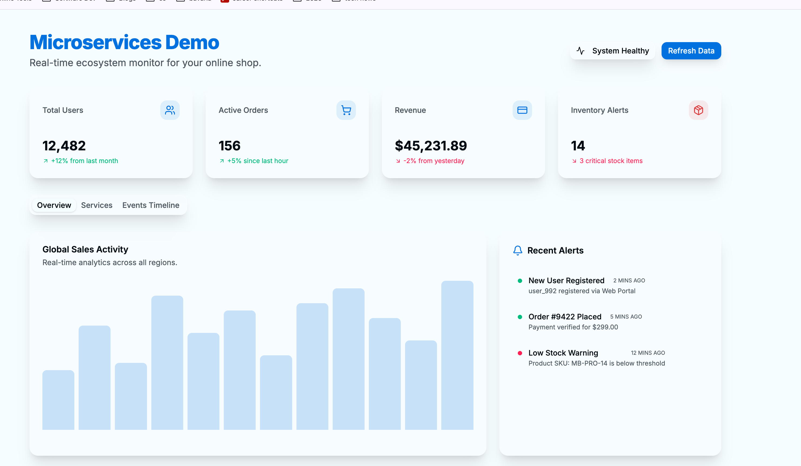

# Online Shop Microservices Ecosystem

A modern, event-driven microservices demonstration built with Spring Boot 3.5.5, RabbitMQ, and a Polyglot Persistence strategy (PostgreSQL + MongoDB).



## System Overview

This project showcases a scalable microservices architecture leveraging Domain-Driven Design (DDD) and asynchronous event-driven communication.

### Architecture Highlights
- **Framework**: Spring Boot 3.5.5
- **Infrastructure**: Spring Cloud Gateway (API Gateway) & Netflix Eureka (Service Discovery)
- **Messaging**: RabbitMQ for asynchronous order processing and real-time notifications.
- **Persistence**: 
  - **PostgreSQL**: Transactional data (Users, Orders, Inventory).
  - **MongoDB**: Flexible document data (Products, Reviews, Analytics).
- **Frontend**: Next.js 15, Shadcn UI, and Tailwind CSS.

## Getting Started

### Prerequisites
- Docker & Docker Compose
- Java 17+
- Node.js 18+

### Setup Instructions

1. **Infrastructure**:
   ```bash
   docker compose up -d
   ```

2. **Backend Services**:
   Run each service using `./gradlew bootRun` (starting with `discovery-service` and `api-gateway`).

3. **Frontend**:
   ```bash
   cd frontend/app
   npm install
   npm run dev
   ```

## Service Mapping

| Service | Port | Persistence | Key Role |
|---------|------|-------------|----------|
| **API Gateway** | 8080 | N/A | Unified entry point |
| **Discovery Service** | 8761 | N/A | Eureka Service Registry |
| **User Service** | 8081 | PostgreSQL | User & Profile Management |
| **Order Service** | 8082 | PostgreSQL | Event Producer: Order Lifecycle |
| **Inventory Service** | 8083 | PostgreSQL | Event Consumer: Stock Updates |
| **Product Service** | 8084 | MongoDB | Product Catalog |
| **Notification Service** | 8085 | N/A | Event Consumer: Real-time Alerts |
| **Analytics Service** | 8086 | MongoDB | Event Consumer: Data Aggregation |
| **Review Service** | 8087 | MongoDB | Customer Feedback |

---
